# Description
## Abskoth - an Absrad fight mod
Installing this mod will allow Markoth to spawn in the Absolute Radiance fight. By default, two will spawn. Mod settings can be changed to allow for 1-4 Markoths to spawn in the fight, as well as to remove Markoth's nails from spawning. Markoth will follow you through each phase of the fight.

# Launching the mod
## First download the latest mod repository:
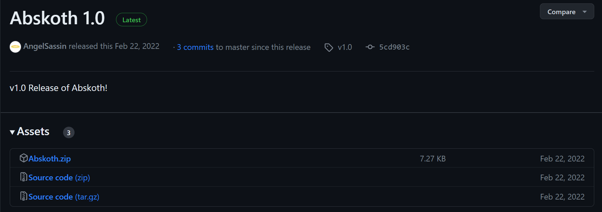

## Then you are required to unpack the archive:

## Then move the folder to the mods of the game:
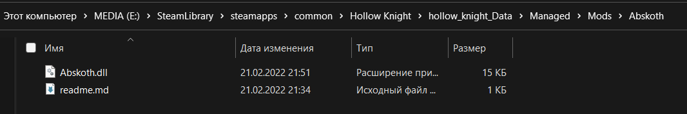

## Launch the game and check that the mod is visible in the game:

# How the mod works in the game
## The first thing we need to do is find Godseeker:
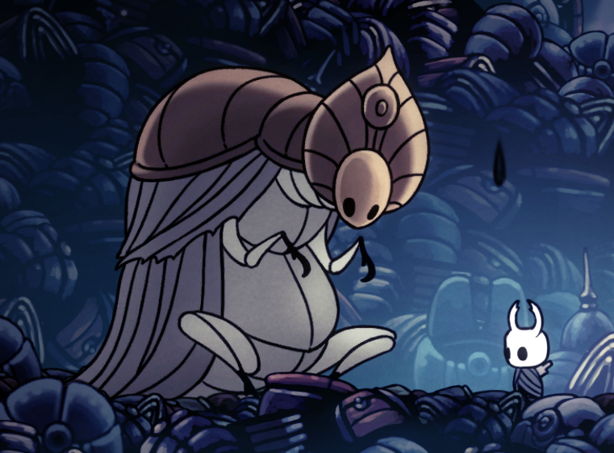

## Then your task is to pass the pantheon of Hallownest:
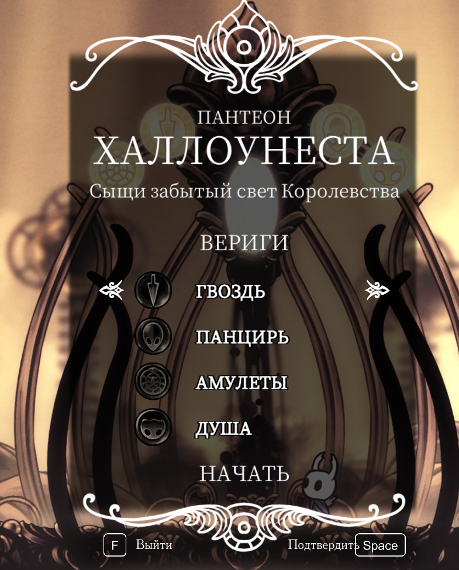

## After, in the hall of the gods find Absolute Radiance:
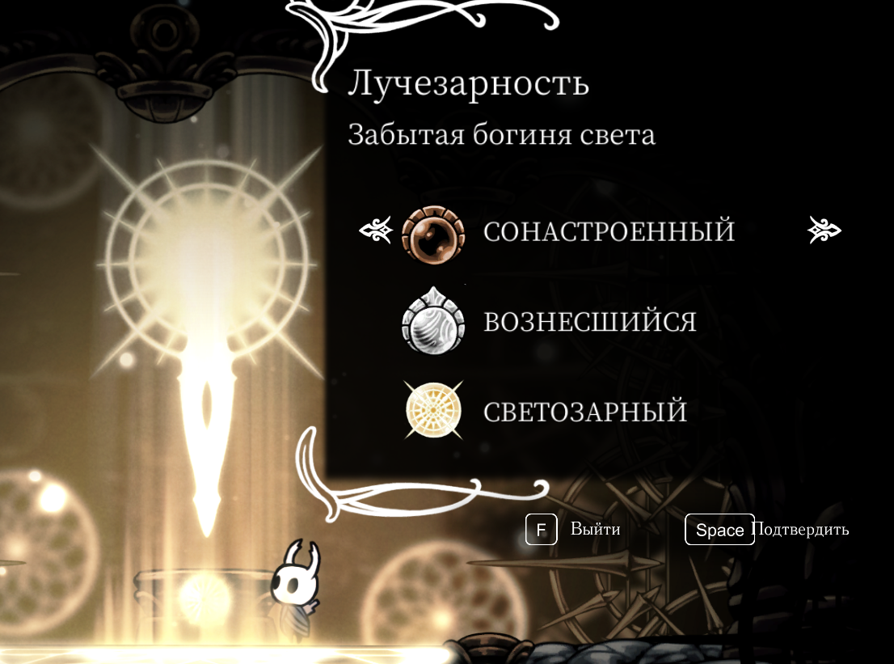

## Enjoying the mod:
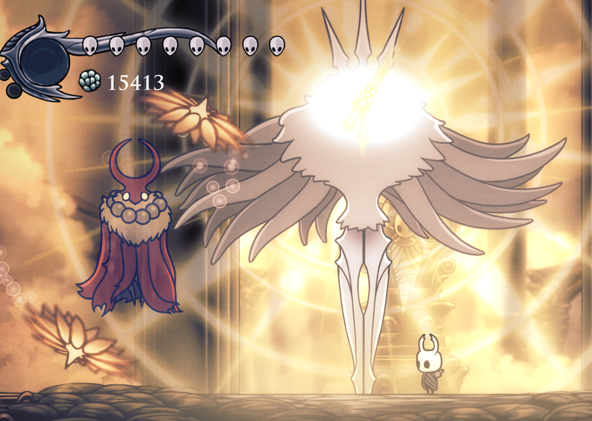

# Changes in the game mode
## Through the game itself:
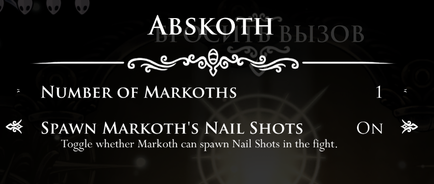

### Example of new settings:
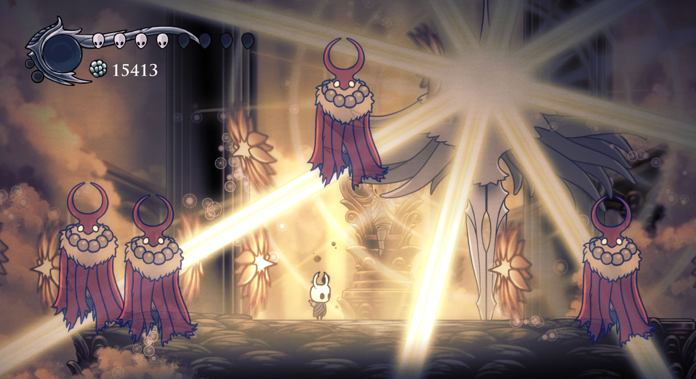

## Changing settings on file:
### You need to go to the folder:
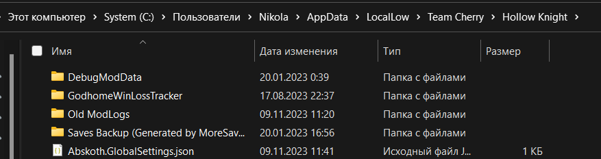

### Change the settings file to suit your requirements:
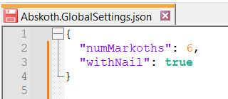

### Example of new settings:
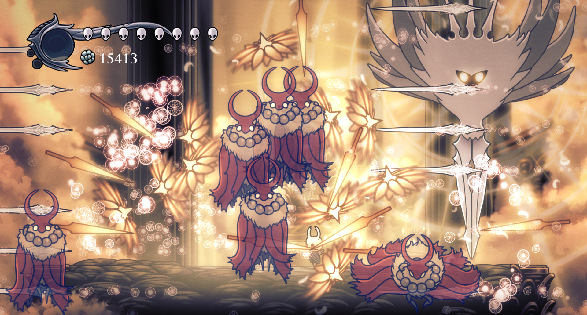